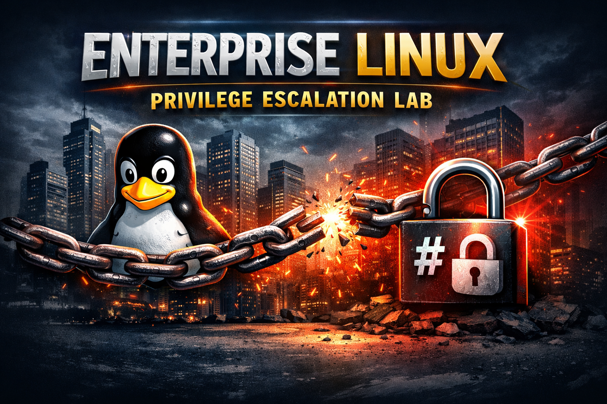

# 🏢 Enterprise Linux Privilege Escalation Lab (15 Levels)

A **realistic, linear, enterprise-style Linux privilege escalation lab** designed for **Red Teamers, penetration testers, and security learners** who want to practice **real-world Linux misconfigurations** — not artificial CTF tricks.

This lab enforces a **strict escalation chain**:

`user1 → user2 → user3 → user4 → user5 → user6 → user7 → user8 → user9 → user10 → user11 → user12 → user13 → user14 → user15 → root`

No skipping. No brute force. Just **enumeration + exploitation**, exactly like real enterprise environments.

---

<p align="center">
  
</p>

<p align="center">
  
  
  
  
</p>

---

## 🔥 Features

- 15 progressive privilege escalation levels
- Strict linear chain (no skipping)
- Enterprise-style Linux misconfigurations
- No external exploitation frameworks required
- Fully automated installation and cleanup
- Random passwords generated per installation
- Bash or Zsh shell selection
- Clean user isolation

---

## 🧠 Attack Flow

```

user1 → user2 → user3 → user4 → user5
user6 → user7 → user8 → user9 → user10
user11 → user12 → user13 → user14 → user15 → root

```

- **Entry user:** `user1`  
- **Final objective:** `/root/flag.txt`

---

## 🎯 Challenge Matrix (Script-Accurate)

| Level | From   | To     | Technique                                          |
|------:|--------|--------|----------------------------------------------------|
| 1     | user1  | user2  | Sudo file read (`/var/log/helpdesk/tickets.log`)  |
| 2     | user2  | user3  | Group-readable backup (`/var/backups/app/creds.txt`) |
| 3     | user3  | user4  | Sudo script execution (`/opt/tools/backup.sh`)    |
| 4     | user4  | user5  | Sudo script reading user5's secret file            |
| 5     | user5  | user6  | Sudo cat of user6's password file                  |
| 6     | user6  | user7  | `less` via sudo (shell escape to read `/etc/app.conf`) |
| 7     | user7  | user8  | Sudo cat of user8's secret file                    |
| 8     | user8  | user9  | World-readable script (`/opt/scripts/backup.sh`)  |
| 9     | user9  | user10 | Hidden `.config` credentials                       |
| 10    | user10 | user11 | World-readable config (`/etc/db.conf`)             |
| 11    | user11 | user12 | Sudo-readable script (`/usr/local/bin/monitor.sh`)|
| 12    | user12 | user13 | Backup credential exposure (`/etc/passwd.bak`)    |
| 13    | user13 | user14 | Group-executable script (`/usr/local/bin/system_rotate.sh`) |
| 14    | user14 | user15 | Sudo shell as user15 (`/bin/bash`)                 |
| 15    | user15 | root   | Sudo cat of root flag (`/root/flag.txt`)           |

---

## 🛡️ Attack Vectors Covered

- Sudo misconfigurations (file reads, script execution, shell escapes)
- Group permission abuse
- World-readable sensitive files and scripts
- Hidden dotfiles and directories
- Backup credential exposure
- Script ownership and permission mistakes

All scenarios reflect **real enterprise security failures**.

---

## ⚙️ Requirements

- Linux (Kali / Ubuntu / Debian / Arch)
- Root privileges
- Required tools:
  - `bash`
  - `openssl` (for password generation)
  - `less` (for level 6)
  - `zsh` (optional, if selected during install)

> **Note:** Python and Git are **not** required for this lab. The script is pure Bash.

---

## 🚀 Installation

```bash
git clone https://github.com/pashamasr01287654800/privilege-escalation-playground.git
cd privilege-escalation-playground
chmod +x lab.sh
sudo ./lab.sh
```

During installation, you will be prompted to choose the default shell for lab users (bash or zsh). All users and passwords are created automatically.

---

🧹 Cleanup

To completely remove the lab:

```bash
sudo ./lab.sh
# then select option 2 from the menu
```

Or run directly:

```bash
sudo ./lab.sh cleanup
```

---

📄 File Structure

· lab.sh – Main installer / cleaner script
· /root/lab_passwords.txt – Passwords for all users (root only)
· /root/flag.txt – Final flag

---

📝 Tips for the Learner

· Start with su - user1 using the password from /root/lab_passwords.txt.
· Each level requires you to exploit a specific misconfiguration to move to the next user.
· Don't skip levels or use brute force — the solution is in careful enumeration.
· Use sudo -l, check file permissions, look for hidden files, and examine scripts.

---

🤝 Contributing

Contributions and suggestions are welcome! If you find a bug or want to add a new level, please open an issue or pull request.

---

🌟 Acknowledgments

Designed for educational purposes to teach privilege escalation techniques in a safe and legal environment. Use only on systems you own or have explicit permission to test.

Happy hacking! 🚀


